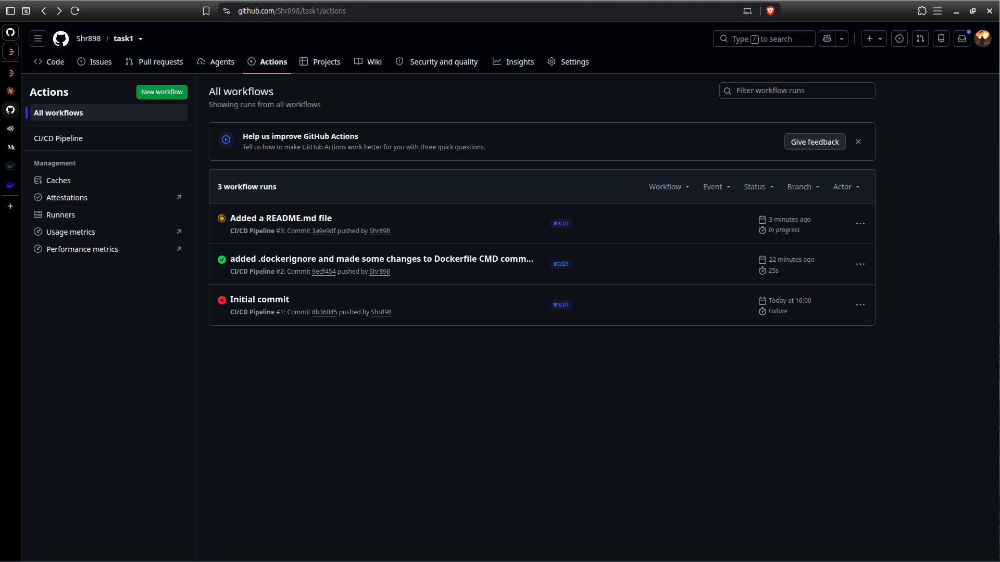
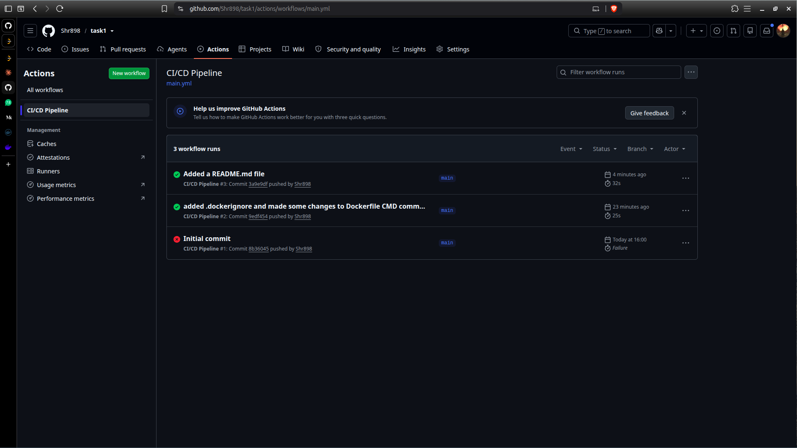

In this task1 I have created a demo nodejs express app which is just a dummy code.
The github actions I've done gets triggered once I push the code to github and it then starts up runner and pushes the app image to dockerhub.
It also successfully did all the mentioned steps. 
I have created .gitignore and .dockerignore files to ignore directories such as node_modules and also ignore .git in the docker image build.
## Screenshots

## This is the third job run where README.md file was added running.

## This is when the all the last job ran successfully.
